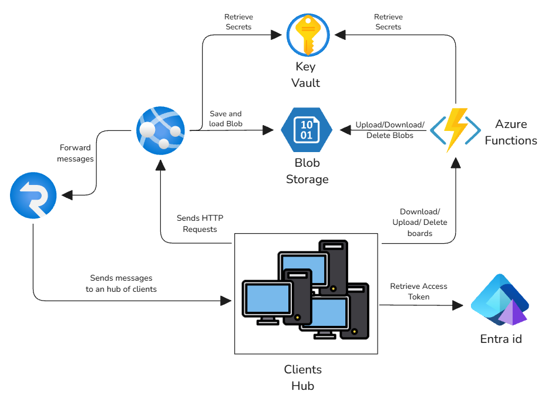

# Excali-Fun

<!--T: Logo of Excalidraw or Video of it -->

Excali-Fun is a webapp inspired to Excalidraw: https://excalidraw.com/.
Excali-Fun is a webapp application that allows multiple clients to draw on a virtual board in real-time.
We realized this webapp like project of the Cloud's exam

## Run the application
To create azure resources and deploy the application on cloud you can run the *deploy.sh* script that is contained in the *ops* directory.
```sh
cd ops
./deploy.sh
```
To eliminate all the resource you can run the *undeploy.sh* shell script.

## Project Architecture


## Services used
- **Azure App Service**: It is used to run the web-app server that use Spring.
- **Azure SignalR**: It is used to lighten the server load by handling client WebSocket connections and sending messages to clients within the same group.
- **Azure EntraId**: It is used to manage user authentication. It allows users to log in using a Microsoft account.
- **Azure KeyVault**: It is used to manage the secrets that are used by other services(Azure SignalR accountKey, Azure Blob Storage accountKey...)
- **Azure Blob Storage**: It is used to persist boards in memory.
- **Azure Function**: It is used to handle some bulk operations: download, delete and upload boards. 

## Structure of Repository
The repository is structured as follows:
- **app directory**: In this directory there is the code that implement the communication between clients, the storing of loaded boards and the front-end that is distributed to clients.
- **functions** dir: In this directory there is the code of the Azure Functions.
- **ops** dir: In this directory, there is all the necessary bash scripts to deploy/undeploy resources from Azure.